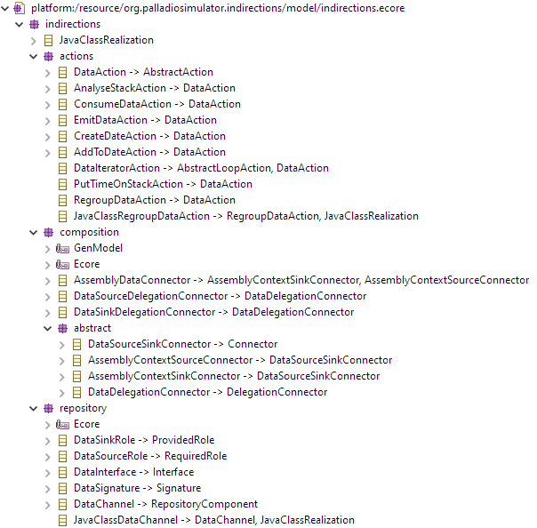

# General remarks about data
Data is similar to other variables that can be passed between components via calls.
However, data can also be collections and groups.
Usually, concrete values are used inside the model/simulation instead of passing stochastic representations between components.
In general, a date in the current context corresponds to a mapping of keys (strings) to values.
There are different types of data that will be available in the simulation/analysis, mainly separated between grouped data (`org.palladiosimulator.indirections.scheduler.data.GroupingIndirectionDate<T>` and its implementations) and other `IndirectionDates`.

# Metamodel

The metamodel structure follows the PCM:

| Indirections Package | NsURI | Corresponding PCM Package | NsURI |
|---|---|---|---|
| indirections.repository | …/Indirections/Repository/1.0 | pcm.repository | …/PalladioComponentModel/Repository/5.2 |
| indirections.actions | …/Indirections/Actions/1.0 | pcm.seff | …/PalladioComponentModel/SEFF/5.2 |
| indirections.composition | …/Indirections/Composition/1.0 | pcm.core.composition | …/PalladioComponentModel/Core/Composition/5.2 |
| indirections.composition.abstract | …/Indirections/Composition/Abstract/1.0 | pcm.core.composition | …/PalladioComponentModel/Core/Composition/5.2 |

## indirections.repository
Everything that can be used in a repository.
`DataChannel`s and `BasicComponent`s both can:
* provide/require `DataSinkRole`s/`DataSourceRole`s
* be instantiated and wired in an `AssemblyContext` (and subsequently allocated)

### DataSinkRole
Corresponds to `OperationProvidedRole`.
Describes, for which kind of data a component can act as a *sink*, i.e., which data a component can *accept* and process.

### DataSourceRole
Corresponds to `OperationRequiredRole`.
Describes, for which kind of data a component can act as a *source*, i.e., which data a component can *provide*.

### DataInterface
The data that can be provided/required.
Contains exactly one `DataSignature` which in turn contains exactly one  `Parameter`.

### DataSignature
Contains exactly one `Parameter` that describes the data structure and the name under which data will be made available in subsequent components.
The description of the data (`Parameter.dataType__Parameter : DataType`) is currently not used in the simulation but acts as documentation.

### DataChannel
The core element that accepts/provides data. Abstract to allow realization in different implementations.
In general, a `DataChannel` provides `DataSinkRole`s and requires `DataSourceRole`s.

### JavaClassDataChannel
The current only realization of `DataChannel` which maps a model element to a realization in a Java class (referenced by its fully qualified name `realizingClassFqn`). Parameters are realized by a list of `configEntries` which are strings of the form "key->value".

This means that currently the different data channels (i.e., joining, windowing/grouping, filtering) are realized with different Java classes. There is one base implementation (`org.palladiosimulator.indirections.scheduler.AbstractSimDataChannelResource`) and different concrete implementations which are located in the packages `org.palladiosimulator.indirections.scheduler.implementations` and `org.palladiosimulator.indirections.scheduler.implementations.generic`.

Future realizations could be modeled in more detail in the model itself with a corresponding meta modeling language, for example for describing different queues and data passing between them, as sketched in [1].

## indirections.actions
Everything that can be used in a SEFF.

### DataAction
Abstract parent class for a SEFF action that references some kind of data in the current context.

### AnalyseStackAction
Measure the age of the referenced data in the current context.
Should be replaced by a more clean implementation using a Monitor/Measurements model.

### ConsumeDataAction
Take data from a `DataSinkRole` and put it on the stack.
Can block if the data channel cannot provide data (and is configured to block in this case).

### EmitDataAction
Write the referenced data to a `DataSourceRole`.
Can block if the data channel cannot accept data (and is configured to block in this case).

### CreateDataAction
Creates a data in the current context.
The properties of the data are described by the `VariableUsage`s in the create data action.

### AddToDataAction
Add or overwrite a key of the referenced data.

### DataIteratorAction
Execute a `ResourceDemandingBehaviour` (i.e., a "sub-SEFF") for each element in a date.
Only works if the data is iterable (i.e., in the simulation there has to be a `org.palladiosimulator.indirections.scheduler.data.GroupingIndirectionDate<T>`).

### PutTimeOnStackAction
***--- currently not implemented in the simulation ---***

Put the current simulation time on the stack to make it available, for example for comparison with other time values or to include it in a date.

### RegroupDataAction
***--- currently not implemented in the simulation ---***

Take a date and regroup it in some way (i.e., not create a new date but modify a date in the current context).

### JavaClassRegroupDataAction
***--- currently not implemented in the simulation ---***

Implement the `RegroupDataAction` via a Java class that is instantiated and used in the simulation.

## indirections.composition.abstract
### DataSourceSinkConnector
(Abstract) connector of a `DataSourceRole` to a `DataSinkRole`.

### AssemblyContextSourceConnector
(Abstract) connector that has an `AssemblyContext` as the source.

### AssemblyContextSinkConnector
(Abstract) connector that has an `AssemblyContext` as the sink.

### DataDelegationConnector
(Abstract) connector that delegates a role to an inner `AssemblyContext` (for example a component in case of a system).

## indirections.composition
Everything that can be used in the system model.
Covers instantiation and wiring of components.

### AssemblyDataConnector
Connect a `DataSourceRole` of an `AssemblyContext` (here mostly for a `DataChannel` or `BasicComponent`) to a `DataSinkRole` of an `AssemblyContext` (i.e. the "wire" over which data is passed).

### DataSourceDelegationConnector
Delegates a `DataSourceRole` from a structure (e.g. a system) to an inner `AssemblyContext` (e.g. a component or data channel).
Used for hierarchical models.

### DataSinkDelegationConnector
Delegates a `DataSinkRole` from a structure (e.g. a system) to an inner `AssemblyContext` (e.g. a component or data channel).
Used for hierarchical models.

[1]: <cite>Werle, Dominik, Stephan Seifermann, and Anne Koziolek. "Data Stream Operations as First-Class Entities in Component-Based Performance Models." European Conference on Software Architecture. Springer, Cham, 2020.</cite>